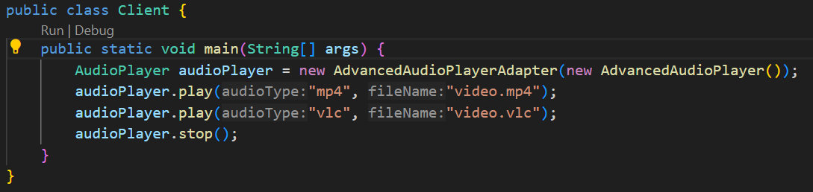
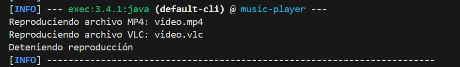

# Juan José Rodríguez Falla

Aqui se puede observar que se le pide al reproductor: 


Aqui se puede observar la salida: 


Para compilar:

```bash
mvn compile
```

Para ejecutar la aplicación:

```bash
mvn exec:java -Dexec.mainClass=main.java.edu.unisabana.dyas.patterns.Client
```
